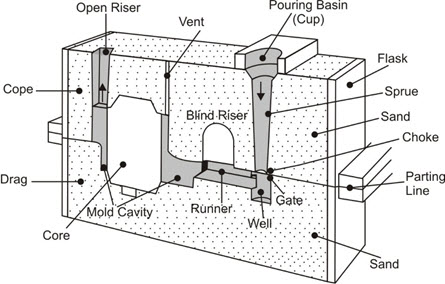
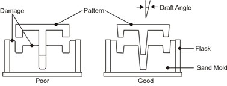
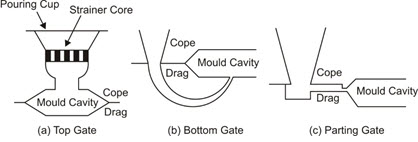
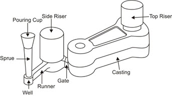

### SAND CASTING PROCESS
•	The most universal method of making castings is by using sand moulds. Sand moulds are made by ramming sand in a metallic or wooden flask. Such a casting process is commonly referred to as sand casting process. 
•	The steps required for making metal castings using sand casting process are mentioned below and also depicted in the figure below: 
Step 1: Pattern making 
Step 2: Core making 
Step 3: Mould making 
Step 4: Melting of metal and pouring 
Step 5: Cooling and solidification 
Step 6: Cleaning of castings and inspection

### Step 1: Pattern making 
•	The pattern is a physical replica of the exterior of the casting with dimensional allocation for shrinkage and finishing used to make the mould. 
•	The cavity in the mould is prepared with the help of the pattern and is a replica of the casting required. 
•	It is constructed in such a way that it can be used for forming an impression in sand or other material used for making the mould. 
•	The pattern can be made from anything as long as it is robust enough to be handled during the mould making process. 
•	Patterns are usually made of wood, plastic, metal, or plaster. 
•	A pattern has to be made before making a mould.

### Step 2: Core making 
•	If the casting is to be hollow, additional patterns called cores are used to create these cavities in the finished product. 
•	Cores are pre-determined shaped mass of dry sand, which are placed into the mould before pouring the molten metal to create the interior contours of the casting. 
•	They are typically made of a sand mixture - sand combined with water and organic adhesives called binders- which is baked to form the core. 
•	This allows the cores to be strong yet collapsible, so they can be easily removed from the finished casting. 
•	Since cores are made in moulds, they require a pattern and mould, called a core box.

### Step 3: Mould making 
•	Moulding is the multi-step process in which moulds are created with the desired cavity in a suitable material, like sand, to pour the molten metal. 
•	The mould is made by packing some readily formed aggregate material, such as moulding sand, around the pattern. 
•	When the pattern is withdrawn, its imprint provides the mould cavity, which is ultimately filled with metal to become the casting. 
•	A mould is required to get the desired shape and size of the metal casting. 
•	Sand is a good refractory material for most of the metals and is mostly used for moulding.

### Step 4: Melting of metal and pouring 
•	Melting is the preparation of the molten metal for casting, and its conversion from a solid to a liquid state in a furnace. 
•	It is then transferred in a ladle to the moulding area of the foundry where it is poured into the moulds. 
•	After the metal has solidified, the moulds are vibrated to remove the sand from the casting, a process called shakeout. 
•	For melting of the metal during casting different types of furnaces are used. 
•	The type and size of the furnace may depend on the size of casting, quantity to be produced, production rate, and metal to be cast.

### Step 5: Cooling and solidification 
•	This step incorporates the time-span taken by the casting to cool down and solidify. 
•	This is the phase where casting defects generally develop. 

### Step 6: Cleaning of castings and inspection 
•	Cleaning generally refers to the removal of all materials that are not part of the finished casting. 
•	Rough cleaning is the removal of the gating systems from the casting. 
•	Initial finishing removes any residual mould or core sand that remains on the piece after it is free of the mould. 
•	Trimming removes any unnecessary metal. 
•	In the last stages of finishing, the surface of the casting is cleaned for improved appearance.

### CASTING TERMINOLOGY 
•	The casting starts with the construction of a pattern, a duplicate of the final casting with allowances. 
•	The moulding material is then packed around the pattern, and the pattern is removed to produce a mould cavity. 
•	The term casting is used to describe both the process and the product when molten metal is poured and solidified in a mould.

### Flask 
•	The flask is the box that contains the moulding aggregate.

### Cope 
•	In a two-part mould, the cope is the top half of the pattern, flask, mould or core.

### Drag 
•	The drag is the bottom half of any of the pattern, flask, mould or core. 
•	A core is a sand shape that is inserted into the mould to produce internal features on a casting, such as holes or passages for water cooling.

### Core Print 
•	A core print is the region added to the pattern, core, or mould that is used to locate and support the core within the mould. 
•	The mould material and the core then combine to form the mould cavity, the void into which the molten metal will be poured and solidified to produce the desired casting.

### Parting Line 
•	The parting line or parting surface is the interface that separates the cope and drag halves of the mould, flask, or pattern, and the halves of a core during some core-making processes.

### Draft 
•	The draft is the taper on a pattern or casting that permits it to be withdrawn from the mould. 
•	The mould or die used to produce casting cores is known as a core box.

### Pouring cup 
•	The molten metal is not directly poured into the mould cavity because it may cause mould erosion. 
•	Molten metal is poured into a pouring basin, which acts as a reservoir from which it moves smoothly into the sprue.

### Sprue 
•	Sprue helps in feeding metal to the runner, which in turn reaches the cavity through the gates. 
•	The sprue may have either straight or taper shape. 
•	In straight or parallel sprue, the metal contracts inwards and is pulled away from the sprue walls. 
•	In a tapered sprue, the liquid metal flows down firmly in contact with walls and this reduces turbulence and eliminates sucking of gas or air from the mould (Air Aspiration).

### Sprue base 
•	This is a reservoir for metal at the bottom of the sprue to reduce the momentum of the falling molten metal. 
•	The molten metal, as it moves down the sprue gains in velocity, some of which is lost in the sprue base well, and the mould erosion is reduced. 
•	This molten metal changes direction in the sprue base and flows into the runner in a more uniform way.

### Riser 
•	The riser is designed to serve as a reservoir of metal which stays liquid longer than the casting and "feeds" liquid to fill any shrinkage cavities which tend to develop in the casting. 
•	If the metal does not appear in the riser, it signifies that either the metal is insufficient to fill the mould cavity or there is some abstraction to the metal flow between the sprue and riser.

### Runner 
•	Runner is used to take the molten metal from the sprue base and distribute it to several gate passageways around the cavity.

### Gate 
•	The gate is a channel, which connects runner with the mould cavity and through which molten metal flows to fill the mould cavity. 
•	In top gating, the molten material falls directly into the mould cavity through a height. 
•	In bottom gating, the molten material enters the mould cavity from the bottom and hence there is no problem of scouring and splashing. 
•	But, in case of bottom gating system since molten material enters from bottom, if freezing of molten metal takes place then it could choke off metal flow before mould is full. 
•	Bottom gating creates an unfavourable temperature gradient and makes it difficult to achieve directional solidification. Bottom gating is used for heavy castings. 
•	In parting gate the molten material enters the mould at the parting plane.

### GATING SYSTEM 
•	Gating systems are necessary for the molten metal to flow into the mould cavity. 
•	The gating system is the network of channels used to deliver the molten metal from outside the mould into the mould cavity. 
•	The way in which the liquid metal enters the mould has a decided influence upon the quality and soundness of the casting, the different components of a gating system should be carefully designed and produced.

